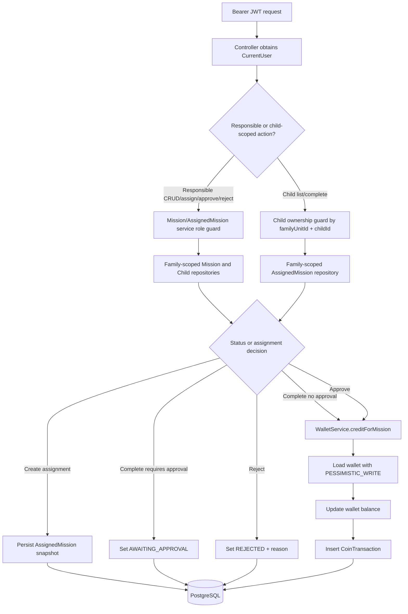

# Phase 2: Domínio de missões e moedas - Research

**Researched:** 2026-05-29
**Domain:** Spring Boot backend domain model, mission workflow, wallet ledger, transactional integrity
**Confidence:** HIGH

<user_constraints>
## User Constraints (from CONTEXT.md)

### Locked Decisions
## Implementation Decisions

### Mission and Assignment Model
- **D-01:** `Mission` acts as the reusable mission template created by the responsible adult.
- **D-02:** `AssignedMission` must store a partial snapshot of the mission at assignment time. At minimum, store the coin value and enough display data to preserve historical meaning when the original mission is edited later.
- **D-03:** Phase 2 must not generate recurring assignments automatically. Assignment rows are created explicitly by the responsible adult.
- **D-04:** `Mission` may include `recurrenceType` as inactive/future-facing metadata, but planners must treat it as non-automated in Phase 2.
- **D-05:** The backend must block an active duplicate assignment of the same mission to the same child. A child should not have two open assignments for the same mission at the same time.
- **D-06:** `Mission` should include the MVP fields plus inactive recurrence metadata: `title`, `description`, `coinValue`, `requiresApproval`, `recurrenceType`, `active`, `createdByUserId`, and timestamps.
- **D-07:** `AssignedMission` should include `missionId`, `childId`, status fields, optional due date, completion/approval/rejection timestamps, optional rejection reason, and snapshot fields needed for historical audit.

### Carry Forward From Prior Phases
- **D-08:** Backend remains the source of truth for mission rules, approvals, wallet balance, coin credits, and ledger history.
- **D-09:** Protected operations must derive `familyUnitId` from `CurrentUser`, never from client-supplied payloads.
- **D-10:** Family-scoped queries and service guards remain the default tenant-isolation mechanism.
- **D-11:** Cross-family access should continue using safe not-found style responses where practical, consistent with Phase 1 child APIs.
- **D-12:** Coin values are positive integers only.
- **D-13:** Wallet balance changes must happen in transactional services and must write a matching `CoinTransaction`.
- **D-14:** Missions should be soft-deactivated, not physically deleted, to preserve assignment, approval, and transaction history.

### the agent's Discretion
- Completion, approval, rejection, child-access endpoint details, wallet locking strategy, and exact `CoinTransaction` field names were not discussed by the user in this session. Researcher and planner may choose pragmatic defaults that preserve the locked requirements, family isolation, transactional wallet integrity, and auditability.

### Deferred Ideas (OUT OF SCOPE)
- Automatic recurring mission generation belongs to a future phase.
- Rewards, redemptions, debits, wallet statement history, mobile screens, and dashboard behavior remain in later roadmap phases.
</user_constraints>

<phase_requirements>
## Phase Requirements

| ID | Description | Research Support |
|----|-------------|------------------|
| MISS-01 | Responsible adult can create, edit, list, view, and deactivate missions. | Use `missions` domain package, soft deactivate, responsible-only service guards, family-scoped repositories. [VERIFIED: .planning/REQUIREMENTS.md] [VERIFIED: codebase grep] |
| MISS-02 | Mission coin value must be a positive integer. | Enforce Bean Validation on DTO and DB `CHECK (coin_value > 0)`. [VERIFIED: docs/data-model.md] [ASSUMED] |
| MISS-03 | Responsible adult can assign a mission to one or more children. | Assignment service validates mission and children in `CurrentUser.familyUnitId`, snapshots mission fields, blocks duplicate open assignments. [VERIFIED: 02-CONTEXT.md] [VERIFIED: docs/api-contract.md] |
| MISS-04 | Child can list only their own assigned pending missions. | Endpoint `/children/{childId}/missions` must validate child belongs to family; list `PENDING` only for child-facing pending view. [VERIFIED: docs/api-contract.md] [VERIFIED: docs/architecture.md] |
| MISS-05 | Child can mark their own assigned mission as completed. | Completion endpoint changes `PENDING -> COMPLETED` or `PENDING -> AWAITING_APPROVAL` depending on assignment snapshot. [VERIFIED: .planning/REQUIREMENTS.md] [VERIFIED: 02-CONTEXT.md] |
| MISS-06 | Mission without approval credits coins automatically on completion. | Completion service must call wallet credit service in the same transaction. [VERIFIED: .planning/REQUIREMENTS.md] [CITED: https://docs.spring.io/spring-framework/reference/data-access/transaction/declarative/annotations.html] |
| MISS-07 | Mission requiring approval moves to `AWAITING_APPROVAL` after child completion. | Status machine must prevent credit until approval. [VERIFIED: .planning/REQUIREMENTS.md] |
| MISS-08 | Responsible adult can approve awaiting mission completion. | Approval service validates status, role, family, then credits once and records approval timestamp. [VERIFIED: .planning/REQUIREMENTS.md] [VERIFIED: docs/testing-strategy.md] |
| MISS-09 | Responsible adult can reject awaiting mission completion with optional reason. | Rejection service records rejection timestamp/reason and must not credit. [VERIFIED: .planning/REQUIREMENTS.md] [VERIFIED: docs/testing-strategy.md] |
| WALT-01 | Child wallet exposes current balance. | Add `GET /children/{childId}/wallet` using family-scoped wallet lookup. [VERIFIED: docs/api-contract.md] [VERIFIED: codebase grep] |
| WALT-02 | Mission approval or auto-completion credits child wallet transactionally. | Use one `@Transactional` service method that updates wallet and inserts `CoinTransaction`. [VERIFIED: DECISIONS.md] [CITED: https://docs.spring.io/spring-framework/reference/data-access/transaction/declarative/annotations.html] |
| WALT-04 | Every credit, debit, or adjustment creates a `CoinTransaction`. | Phase 2 implements credits only but table should model all types for Phase 3 compatibility. [VERIFIED: docs/data-model.md] [VERIFIED: ROADMAP.md] |
| WALT-06 | Balance-changing operations are atomic and safe from partial updates. | Use transactional service plus repository-level `@Lock(PESSIMISTIC_WRITE)` for wallet row. [CITED: https://docs.spring.io/spring-data/jpa/reference/jpa/locking.html] [CITED: https://www.postgresql.org/docs/current/explicit-locking.html] |
| DOCS-01 | Backend endpoints implemented in each backend phase are exposed through OpenAPI/Swagger. | Existing springdoc config exposes `/v3/api-docs` and `/swagger-ui.html`; annotate/structure new controllers so endpoints appear. [VERIFIED: codebase grep] [CITED: https://github.com/springdoc/springdoc-openapi] |
</phase_requirements>

## Summary

Phase 2 should be planned as a backend-only vertical slice over the existing Spring Boot 3.5.14 codebase: add `missions` entities/endpoints, extend `wallet` with a transactional credit API, and add `CoinTransaction` ledger persistence. [VERIFIED: backend/pom.xml] [VERIFIED: ROADMAP.md] The existing Phase 1 patterns already establish controller -> service -> repository flow, `CurrentUserProvider`, family-scoped repository methods, PT-BR error messages with English codes, Flyway migrations, MockMvc integration tests, and Testcontainers PostgreSQL. [VERIFIED: codebase grep]

The planner should lock in a simple mission state machine: `PENDING`, `AWAITING_APPROVAL`, `COMPLETED`, `REJECTED`, and `CANCELLED`, with only `PENDING -> COMPLETED`, `PENDING -> AWAITING_APPROVAL`, `AWAITING_APPROVAL -> COMPLETED`, and `AWAITING_APPROVAL -> REJECTED` in Phase 2. [VERIFIED: docs/data-model.md] [ASSUMED] Wallet credits should be centralized in `WalletService.creditForMission(...)`, annotated with `@Transactional`, loading the wallet with a pessimistic write lock before updating balance and inserting the ledger row. [CITED: https://docs.spring.io/spring-data/jpa/reference/jpa/locking.html] [CITED: https://www.postgresql.org/docs/current/explicit-locking.html]

**Primary recommendation:** Implement `MissionService`, `AssignedMissionService`, and a locked `WalletService.creditForMission` as the only path that mutates balances, with integration tests proving tenant isolation, status transitions, idempotency, balance, and `CoinTransaction` consistency. [VERIFIED: docs/testing-strategy.md] [VERIFIED: DECISIONS.md]

## Project Constraints (from AGENTS.md)

No `AGENTS.md` was found under the project root. [VERIFIED: find . -maxdepth 3 -name AGENTS.md]

## Architectural Responsibility Map

| Capability | Primary Tier | Secondary Tier | Rationale |
|------------|--------------|----------------|-----------|
| Mission template CRUD | API / Backend | Database / Storage | Backend owns mission rules and persists family-scoped templates. [VERIFIED: docs/architecture.md] |
| Mission assignment | API / Backend | Database / Storage | Backend validates responsible role, child ownership, mission ownership, duplicate open assignment, and snapshots data. [VERIFIED: 02-CONTEXT.md] |
| Child mission completion | API / Backend | Database / Storage | Backend is source of truth for status transition and must derive family context from auth. [VERIFIED: docs/architecture.md] |
| Approval/rejection | API / Backend | Database / Storage | Responsible-only transition changes audit timestamps and gates coin credit. [VERIFIED: .planning/REQUIREMENTS.md] |
| Wallet credit and ledger | API / Backend | Database / Storage | Balance and ledger must change atomically through transactional service. [VERIFIED: DECISIONS.md] |
| OpenAPI exposure | API / Backend | Browser / Client | Backend springdoc generates docs; Swagger UI is the manual browser surface. [VERIFIED: docs/api-contract.md] [CITED: https://github.com/springdoc/springdoc-openapi] |

## Standard Stack

### Core

| Library | Version | Purpose | Why Standard |
|---------|---------|---------|--------------|
| Java | Project target 17; local runtime observed 21.0.2 | Backend language/runtime target | Project locks Java 17; local Java 21 can compile target 17 through Maven config if source/target are honored by Boot parent. [VERIFIED: backend/pom.xml] [VERIFIED: java -version] |
| Spring Boot | 3.5.14 | Application framework and dependency management | Existing parent is 3.5.14; official Spring docs list 3.5.14 as a stable line. [VERIFIED: backend/pom.xml] [CITED: https://docs.spring.io/spring-boot/appendix/dependency-versions/index.html] |
| Spring Web MVC | Managed by Boot | REST controllers | Existing controllers use Spring MVC annotations and MockMvc tests. [VERIFIED: codebase grep] |
| Spring Data JPA / Hibernate | Managed by Boot | Repositories, entity persistence, locking | Existing repositories extend `JpaRepository`; Spring Data JPA supports `@Lock` on query methods. [VERIFIED: codebase grep] [CITED: https://docs.spring.io/spring-data/jpa/reference/jpa/locking.html] |
| PostgreSQL | Test image `postgres:16-alpine`; local service via Docker/Compose | Relational storage and row locks | Existing Testcontainers base uses PostgreSQL 16 image; PostgreSQL row locks block concurrent writers/lockers until transaction end. [VERIFIED: codebase grep] [CITED: https://www.postgresql.org/docs/current/explicit-locking.html] |
| Flyway | Managed by Boot | Schema migrations | Existing schema is `V1__create_foundation_schema.sql`; Flyway versioned migrations are applied once in order and tracked by checksum. [VERIFIED: codebase grep] [CITED: https://documentation.red-gate.com/flyway/flyway-concepts/migrations/versioned-migrations] |
| springdoc-openapi | 2.8.9 | OpenAPI JSON and Swagger UI | Existing dependency is present; springdoc supports Spring Boot 3, Java 17/Jakarta, OpenAPI 3, and Swagger UI. [VERIFIED: backend/pom.xml] [CITED: https://github.com/springdoc/springdoc-openapi] |

### Supporting

| Library | Version | Purpose | When to Use |
|---------|---------|---------|-------------|
| Spring Validation / Jakarta Validation | Managed by Boot | DTO constraints such as positive coin values | Use on request DTOs with `@Positive`, `@NotBlank`, `@Size`. [VERIFIED: backend/pom.xml] [ASSUMED] |
| Spring Security Resource Server | Managed by Boot | JWT-authenticated protected endpoints | Continue existing `CurrentUserProvider` pattern. [VERIFIED: codebase grep] |
| Spring Boot Test + MockMvc | Managed by Boot | Integration tests for REST flows | Existing tests use MockMvc with real app context. [VERIFIED: codebase grep] |
| Testcontainers PostgreSQL | Managed by Boot | PostgreSQL-compatible integration tests | Existing `AbstractIntegrationTest` uses `@ServiceConnection`; Spring Boot docs describe service connections for Testcontainers. [VERIFIED: codebase grep] [CITED: https://docs.spring.io/spring-boot/reference/testing/testcontainers.html] |

### Alternatives Considered

| Instead of | Could Use | Tradeoff |
|------------|-----------|----------|
| Pessimistic wallet row lock | Optimistic `@Version` retry | Optimistic locking needs version column and retry semantics; pessimistic lock is simpler for MVP balance updates. [CITED: https://docs.spring.io/spring-data/jpa/reference/jpa/locking.html] [ASSUMED] |
| JPA repositories | Raw JDBC | JDBC gives explicit SQL but diverges from established repository/entity pattern. [VERIFIED: codebase grep] |
| Entity audit framework | Custom `CoinTransaction` table | `CoinTransaction` is the product ledger, not a generic entity audit trail. [VERIFIED: docs/data-model.md] |

**Installation:**

No new external packages are required for Phase 2; use existing Maven dependencies. [VERIFIED: backend/pom.xml]

**Version verification:** Versions were verified from `backend/pom.xml`, `backend/mvnw -v`, `java -version`, and official Spring/springdoc/Flyway/PostgreSQL docs. [VERIFIED: backend/pom.xml] [CITED: https://docs.spring.io/spring-boot/appendix/dependency-versions/index.html]

## Package Legitimacy Audit

No new external package install is recommended for this phase, so the Package Legitimacy Gate is not applicable. [VERIFIED: backend/pom.xml] `slopcheck` was not available locally, but no package is being introduced. [VERIFIED: command -v slopcheck]

## Architecture Patterns

### System Architecture Diagram



### Recommended Project Structure

```text
backend/src/main/java/br/com/habitinhos/
├── missions/                  # Mission, AssignedMission, services, controllers, repositories
│   └── dto/                   # Mission/assignment/completion/approval request-response records
├── wallet/                    # Extend WalletService, add CoinTransaction entity/repository/controller DTOs
└── shared/error/              # Reuse ApiException hierarchy and PT-BR messages

backend/src/test/java/br/com/habitinhos/
├── missions/                  # Mission CRUD, assignment, completion, approval/rejection, isolation tests
└── wallet/                    # Wallet credit/ledger transactional tests if not covered by missions tests
```

### Pattern 1: Family-Scoped Service Guard

**What:** Controllers pass `CurrentUser` into services; services derive `familyUnitId` from the token and use family-scoped repository methods. [VERIFIED: codebase grep]

**When to use:** Every Phase 2 endpoint that reads or mutates mission, assignment, wallet, or child data. [VERIFIED: docs/architecture.md]

**Example:**

```java
// Source: existing ChildService pattern, backend/src/main/java/br/com/habitinhos/children/ChildService.java
@Transactional(readOnly = true)
public MissionResponse get(CurrentUser currentUser, UUID id) {
  requireResponsible(currentUser);
  return missionRepository.findByIdAndFamilyUnitId(id, currentUser.familyUnitId())
      .map(this::toResponse)
      .orElseThrow(() -> new NotFoundException("MISSION_NOT_FOUND", "Missão não encontrada."));
}
```

### Pattern 2: Assignment Snapshot

**What:** Copy mission display fields and coin/approval values into `AssignedMission` at assignment time. [VERIFIED: 02-CONTEXT.md]

**When to use:** `POST /missions/{id}/assign`, before returning created assignments. [VERIFIED: docs/api-contract.md]

**Example:**

```java
// Source: D-02 from 02-CONTEXT.md; implementation pattern inferred for this codebase.
AssignedMission assigned = new AssignedMission(
    familyUnitId,
    mission.getId(),
    child.getId(),
    mission.getTitle(),
    mission.getDescription(),
    mission.getCoinValue(),
    mission.isRequiresApproval(),
    dueDate);
```

### Pattern 3: Transactional Wallet Credit with Row Lock

**What:** One service method locks the wallet row, updates the balance, and saves the ledger row inside the same transaction. [VERIFIED: DECISIONS.md] [CITED: https://docs.spring.io/spring-framework/reference/data-access/transaction/declarative/annotations.html]

**When to use:** Auto-credit on no-approval completion and responsible approval. [VERIFIED: .planning/REQUIREMENTS.md]

**Example:**

```java
// Source: Spring @Transactional docs + Spring Data JPA @Lock docs.
@Transactional
public CoinTransaction creditForMission(UUID familyUnitId, UUID childId, UUID assignedMissionId,
    int amount, UUID createdByUserId) {
  Wallet wallet = walletRepository
      .findByChildIdAndFamilyUnitIdForUpdate(childId, familyUnitId)
      .orElseThrow(() -> new NotFoundException("WALLET_NOT_FOUND", "Carteira não encontrada."));
  wallet.setBalance(wallet.getBalance() + amount);
  return coinTransactionRepository.save(CoinTransaction.creditMission(
      familyUnitId, wallet.getId(), childId, amount, assignedMissionId, createdByUserId));
}
```

Repository shape:

```java
// Source: Spring Data JPA locking docs.
@Lock(LockModeType.PESSIMISTIC_WRITE)
@Query("select w from Wallet w where w.childId = :childId and w.familyUnitId = :familyUnitId")
Optional<Wallet> findByChildIdAndFamilyUnitIdForUpdate(UUID childId, UUID familyUnitId);
```

### Anti-Patterns to Avoid

- **Trusting `familyUnitId` from payloads:** derive tenant from `CurrentUser`, consistent with ADR-006/013/014. [VERIFIED: DECISIONS.md]
- **Crediting coins directly from mission service without ledger write:** violates ADR-007 and WALT-04. [VERIFIED: DECISIONS.md] [VERIFIED: .planning/REQUIREMENTS.md]
- **Editing old Flyway migrations:** Flyway tracks checksums; roll forward with `V2__...` instead. [CITED: https://documentation.red-gate.com/flyway/flyway-concepts/migrations/versioned-migrations]
- **Physical delete of missions:** D-14 and ADR-008 require soft deactivation to preserve history. [VERIFIED: 02-CONTEXT.md] [VERIFIED: DECISIONS.md]
- **Computing historical credits from current `Mission.coinValue`:** D-02 requires assignment snapshots so edits do not rewrite history. [VERIFIED: 02-CONTEXT.md]

## Don't Hand-Roll

| Problem | Don't Build | Use Instead | Why |
|---------|-------------|-------------|-----|
| Transaction boundaries | Manual commit/rollback logic | Spring `@Transactional` service methods | Spring defaults roll back on runtime exceptions/errors. [CITED: https://docs.spring.io/spring-framework/reference/data-access/transaction/declarative/annotations.html] |
| Wallet concurrency | In-memory locks or synchronized blocks | PostgreSQL row lock via JPA `@Lock(PESSIMISTIC_WRITE)` | Locks must work across requests/processes and release at transaction end. [CITED: https://www.postgresql.org/docs/current/explicit-locking.html] |
| API docs | Hand-written OpenAPI JSON | springdoc-openapi controller scanning plus optional annotations | Existing dependency auto-generates `/v3/api-docs` and Swagger UI. [VERIFIED: backend/pom.xml] [CITED: https://github.com/springdoc/springdoc-openapi] |
| Migration tracking | Manual SQL checklist | Flyway versioned migrations | Flyway applies versioned migrations once and tracks checksums. [CITED: https://documentation.red-gate.com/flyway/flyway-concepts/migrations/versioned-migrations] |
| Tenant isolation | Client-provided tenant fields | `CurrentUser.familyUnitId` and family-scoped queries | This is an accepted architecture decision. [VERIFIED: DECISIONS.md] |

**Key insight:** The deceptively hard parts are not CRUD; they are preserving tenant isolation, assignment history, exactly-once credit, and balance/ledger consistency under failure. [VERIFIED: docs/testing-strategy.md]

## Common Pitfalls

### Pitfall 1: Double Credit on Repeated Completion or Approval

**What goes wrong:** A second call to complete/approve credits the wallet again. [ASSUMED]
**Why it happens:** Service credits before validating current status and absence of prior `CoinTransaction`. [ASSUMED]
**How to avoid:** Treat status transitions as guards; add a unique constraint or application check for one mission-completion ledger row per `assigned_mission_id`. [ASSUMED]
**Warning signs:** Tests assert status only but not wallet balance and transaction count after duplicate calls. [VERIFIED: docs/testing-strategy.md]

### Pitfall 2: Cross-Family ID Mixing

**What goes wrong:** Responsible from one family assigns or completes another family's child/mission. [VERIFIED: docs/architecture.md]
**Why it happens:** Repositories use `findById` instead of `findByIdAndFamilyUnitId`. [VERIFIED: codebase grep]
**How to avoid:** Every lookup that enters from a request path uses family-scoped repository methods and safe not-found responses. [VERIFIED: 02-CONTEXT.md]
**Warning signs:** Tests create only one family. [VERIFIED: docs/testing-strategy.md]

### Pitfall 3: Snapshot Drift

**What goes wrong:** Editing a mission changes open or historical assigned mission display/coin value. [VERIFIED: 02-CONTEXT.md]
**Why it happens:** Responses dereference `Mission` instead of storing assignment snapshot fields. [ASSUMED]
**How to avoid:** Persist `snapshotTitle`, `snapshotDescription`, `snapshotCoinValue`, and `snapshotRequiresApproval`. [ASSUMED]
**Warning signs:** Assigned mission table has only `mission_id`, `child_id`, and status. [VERIFIED: docs/data-model.md]

### Pitfall 4: Incomplete Test Cleanup

**What goes wrong:** Phase 2 tests fail intermittently or violate FKs because cleanup truncates only Phase 1 tables. [VERIFIED: codebase grep]
**Why it happens:** `AbstractIntegrationTest` currently truncates `wallets, child_profiles, app_users, family_units`. [VERIFIED: codebase grep]
**How to avoid:** Update cleanup order to include `coin_transactions`, `assigned_missions`, and `missions` before parent tables. [ASSUMED]
**Warning signs:** Test failures mention FK constraints or data leaked across tests. [ASSUMED]

### Pitfall 5: Swagger Exists but New Endpoints Are Not Useful

**What goes wrong:** `/v3/api-docs` loads but DTOs/status codes/examples are unclear for manual testing. [ASSUMED]
**Why it happens:** Relying only on generated names without response status annotations or tags. [ASSUMED]
**How to avoid:** Keep controllers public, use request/response records, status annotations where needed, and verify endpoint paths in `/v3/api-docs`. [CITED: https://github.com/springdoc/springdoc-openapi]
**Warning signs:** DOCS-01 checked only by app startup, not by inspecting generated API paths. [VERIFIED: docs/testing-strategy.md]

## Code Examples

### Mission Request DTO

```java
// Source: existing DTO record style + Jakarta Validation dependency in pom.xml.
public record MissionRequest(
    @NotBlank @Size(max = 160) String title,
    @Size(max = 1000) String description,
    @Positive int coinValue,
    boolean requiresApproval,
    RecurrenceType recurrenceType) {
}
```

### Status Guard

```java
// Source: requirements MISS-06..MISS-09 and docs/data-model.md statuses.
private void requireStatus(AssignedMission assignment, AssignedMissionStatus expected) {
  if (assignment.getStatus() != expected) {
    throw new ConflictException("INVALID_MISSION_STATUS", "Status da missão não permite esta ação.");
  }
}
```

### Transactional Test Assertion

```java
// Source: docs/testing-strategy.md transaction requirements + existing MockMvc integration style.
assertThat(walletRepository.findByChildIdAndFamilyUnitId(childId, familyUnitId).orElseThrow().getBalance())
    .isEqualTo(10);
assertThat(coinTransactionRepository.findAll()).singleElement()
    .satisfies(tx -> {
      assertThat(tx.getType()).isEqualTo(CoinTransactionType.CREDIT);
      assertThat(tx.getAmount()).isEqualTo(10);
      assertThat(tx.getAssignedMissionId()).isEqualTo(assignedMissionId);
    });
```

## State of the Art

| Old Approach | Current Approach | When Changed | Impact |
|--------------|------------------|--------------|--------|
| Hand-authored Swagger docs | Runtime OpenAPI generation with springdoc starter | Existing Phase 1 dependency | Planner should verify generated paths, not create static OpenAPI files. [VERIFIED: backend/pom.xml] [CITED: https://github.com/springdoc/springdoc-openapi] |
| Manual DB change tracking | Flyway versioned migrations | Existing Phase 1 setup | Phase 2 should add `V2__create_missions_and_coin_transactions.sql`. [VERIFIED: codebase grep] [CITED: https://documentation.red-gate.com/flyway/flyway-concepts/migrations/versioned-migrations] |
| Unlocked wallet update | Transactional row-locked wallet update | Phase 2 decision for PEND-004 | Prevents concurrent partial balance/ledger divergence in this MVP. [CITED: https://www.postgresql.org/docs/current/explicit-locking.html] [ASSUMED] |

**Deprecated/outdated:**
- Springfox/Swagger 2 style docs are not part of this codebase; use existing springdoc OpenAPI v2 starter for Spring Boot 3. [VERIFIED: backend/pom.xml] [CITED: https://github.com/springdoc/springdoc-openapi]

## Assumptions Log

| # | Claim | Section | Risk if Wrong |
|---|-------|---------|---------------|
| A1 | Use DTO `@Positive`, DB `CHECK`, and enum validation for mission coin/status fields. | Phase Requirements, Standard Stack, Code Examples | Planner may need to adapt exact annotations or validation messages. |
| A2 | Pessimistic wallet locking is preferable to optimistic locking for the MVP. | Standard Stack, State of the Art | If expected concurrency is high, planner may choose `@Version` with retries instead. |
| A3 | Duplicate credit should be blocked with status guards plus optional unique ledger constraint by `assigned_mission_id`. | Common Pitfalls | Schema may need a partial unique index or application-only guard. |
| A4 | Snapshot fields should be named `snapshotTitle`, `snapshotDescription`, `snapshotCoinValue`, and `snapshotRequiresApproval`. | Architecture Patterns | Planner may choose different column names while preserving D-02. |
| A5 | Test cleanup must add Phase 2 tables before existing tables. | Common Pitfalls | If `TRUNCATE ... CASCADE` remains sufficient, exact order may be less important. |

## Open Questions

1. **Child authentication model for Phase 2 endpoints**
   - What we know: Phase 1 children are not `User` records and protected endpoints currently use responsible JWTs. [VERIFIED: DECISIONS.md] [VERIFIED: codebase grep]
   - What's unclear: Whether child completion in backend Phase 2 is simulated via responsible-authenticated `/children/{childId}` scoped calls or a separate child access mechanism later. [ASSUMED]
   - Recommendation: Implement child-facing endpoints as authenticated responsible/family-scoped operations with `childId` path ownership checks for now, and avoid adding child JWT auth in Phase 2. [ASSUMED]

2. **Ledger statement endpoint scope**
   - What we know: `GET /children/{childId}/wallet/transactions` is in docs/api-contract, but WALT-05 is Phase 3. [VERIFIED: docs/api-contract.md] [VERIFIED: .planning/REQUIREMENTS.md]
   - What's unclear: Whether Phase 2 should list transactions or only persist ledger and expose balance. [VERIFIED: ROADMAP.md]
   - Recommendation: Implement balance endpoint in Phase 2 and keep transaction listing deferred unless needed to manually inspect ledger. [ASSUMED]

## Environment Availability

| Dependency | Required By | Available | Version | Fallback |
|------------|-------------|-----------|---------|----------|
| Java runtime | Maven build/tests | ✓ | 21.0.2 local; project target 17 | Install/use Java 17 if target compatibility issues appear. [VERIFIED: java -version] [VERIFIED: backend/pom.xml] |
| Maven wrapper | Build/test commands | ✓ | Apache Maven 3.9.11 via `backend/mvnw` | Use wrapper only; no system Maven required. [VERIFIED: backend/mvnw -v] |
| Docker/Colima daemon | Testcontainers PostgreSQL integration tests | ✗ | Docker client points to missing Colima socket | Start Colima/Docker before integration tests. [VERIFIED: docker ps] |
| psql CLI | Manual DB inspection | ✗ | — | Use app tests/JdbcTemplate; psql is not required for implementation. [VERIFIED: command -v psql] |
| ctx7 CLI | Documentation lookup fallback | ✗ | — | Used official docs via web instead. [VERIFIED: command -v ctx7] |

**Missing dependencies with no fallback:**
- Running Testcontainers integration tests is blocked until Docker/Colima is running. [VERIFIED: docker ps]

**Missing dependencies with fallback:**
- `psql` is missing; integration tests and JdbcTemplate can verify behavior. [VERIFIED: command -v psql]
- `ctx7` is missing; official documentation URLs were used. [VERIFIED: command -v ctx7]

## Validation Architecture

### Test Framework

| Property | Value |
|----------|-------|
| Framework | JUnit Jupiter + Spring Boot Test + MockMvc + Testcontainers PostgreSQL, versions managed by Spring Boot 3.5.14. [VERIFIED: backend/pom.xml] |
| Config file | `backend/pom.xml`; shared base `backend/src/test/java/br/com/habitinhos/shared/AbstractIntegrationTest.java`. [VERIFIED: codebase grep] |
| Quick run command | `cd backend && ./mvnw test -Dtest=MissionIntegrationTest,WalletIntegrationTest` [ASSUMED] |
| Full suite command | `cd backend && ./mvnw test` [VERIFIED: backend/mvnw] |

### Phase Requirements → Test Map

| Req ID | Behavior | Test Type | Automated Command | File Exists? |
|--------|----------|-----------|-------------------|--------------|
| MISS-01 | Mission CRUD/deactivation responsible-only and family-scoped | integration | `cd backend && ./mvnw test -Dtest=MissionIntegrationTest` | ❌ Wave 0 |
| MISS-02 | Coin value positive validation | unit/integration | `cd backend && ./mvnw test -Dtest=MissionIntegrationTest` | ❌ Wave 0 |
| MISS-03 | Assign mission to one or more children; block duplicate open assignment | integration | `cd backend && ./mvnw test -Dtest=MissionAssignmentIntegrationTest` | ❌ Wave 0 |
| MISS-04 | Child mission list returns only own pending assignments | integration | `cd backend && ./mvnw test -Dtest=AssignedMissionIntegrationTest` | ❌ Wave 0 |
| MISS-05 | Child marks own assignment completed | integration | `cd backend && ./mvnw test -Dtest=AssignedMissionIntegrationTest` | ❌ Wave 0 |
| MISS-06 | No-approval completion auto-credits wallet and ledger | integration/transaction | `cd backend && ./mvnw test -Dtest=MissionWalletTransactionIntegrationTest` | ❌ Wave 0 |
| MISS-07 | Requires-approval completion moves to awaiting approval only | integration | `cd backend && ./mvnw test -Dtest=MissionApprovalIntegrationTest` | ❌ Wave 0 |
| MISS-08 | Approval credits exactly once | integration/transaction | `cd backend && ./mvnw test -Dtest=MissionApprovalIntegrationTest` | ❌ Wave 0 |
| MISS-09 | Rejection preserves history and does not credit | integration | `cd backend && ./mvnw test -Dtest=MissionApprovalIntegrationTest` | ❌ Wave 0 |
| WALT-01 | Wallet balance endpoint returns child balance family-scoped | integration | `cd backend && ./mvnw test -Dtest=WalletIntegrationTest` | ❌ Wave 0 |
| WALT-02 | Mission credit is transactional | transaction | `cd backend && ./mvnw test -Dtest=MissionWalletTransactionIntegrationTest` | ❌ Wave 0 |
| WALT-04 | Credit creates `CoinTransaction` | transaction | `cd backend && ./mvnw test -Dtest=MissionWalletTransactionIntegrationTest` | ❌ Wave 0 |
| WALT-06 | Failed balance-changing operation leaves wallet/ledger unchanged | transaction | `cd backend && ./mvnw test -Dtest=MissionWalletTransactionIntegrationTest` | ❌ Wave 0 |
| DOCS-01 | `/v3/api-docs` includes Phase 2 paths | smoke/integration | `cd backend && ./mvnw test -Dtest=OpenApiIntegrationTest` | ❌ Wave 0 |

### Sampling Rate

- **Per task commit:** Run the smallest new integration test class for that task, after Docker/Colima is running. [VERIFIED: docs/testing-strategy.md] [VERIFIED: docker ps]
- **Per wave merge:** `cd backend && ./mvnw test`. [VERIFIED: backend/mvnw]
- **Phase gate:** Full suite green plus manual Swagger smoke for mission, assignment, approval, and wallet endpoints. [VERIFIED: docs/testing-strategy.md]

### Wave 0 Gaps

- [ ] `backend/src/test/java/br/com/habitinhos/missions/MissionIntegrationTest.java` — covers MISS-01, MISS-02.
- [ ] `backend/src/test/java/br/com/habitinhos/missions/MissionAssignmentIntegrationTest.java` — covers MISS-03, duplicate assignment, family isolation.
- [ ] `backend/src/test/java/br/com/habitinhos/missions/AssignedMissionIntegrationTest.java` — covers MISS-04, MISS-05, MISS-06, MISS-07.
- [ ] `backend/src/test/java/br/com/habitinhos/missions/MissionApprovalIntegrationTest.java` — covers MISS-08, MISS-09.
- [ ] `backend/src/test/java/br/com/habitinhos/wallet/WalletIntegrationTest.java` or `MissionWalletTransactionIntegrationTest.java` — covers WALT-01, WALT-02, WALT-04, WALT-06.
- [ ] `backend/src/test/java/br/com/habitinhos/OpenApiIntegrationTest.java` — covers DOCS-01 if not already added elsewhere.
- [ ] Update `AbstractIntegrationTest.cleanDatabase()` for Phase 2 tables. [VERIFIED: codebase grep]

## Security Domain

### Applicable ASVS Categories

| ASVS Category | Applies | Standard Control |
|---------------|---------|------------------|
| V2 Authentication | yes | Reuse JWT Bearer auth and `CurrentUserProvider`; do not add child auth in Phase 2 unless explicitly planned. [VERIFIED: codebase grep] [ASSUMED] |
| V3 Session Management | no | Phase 2 does not change token/session mechanics. [VERIFIED: ROADMAP.md] |
| V4 Access Control | yes | Responsible role guards, family-scoped queries, safe not-found for cross-family access. [VERIFIED: DECISIONS.md] [VERIFIED: 02-CONTEXT.md] |
| V5 Input Validation | yes | Bean Validation on DTOs plus DB constraints for positive coins and enum checks. [VERIFIED: backend/pom.xml] [ASSUMED] |
| V6 Cryptography | no | Phase 2 does not add cryptographic storage or token signing behavior. [VERIFIED: ROADMAP.md] |
| V7 Error Handling | yes | Reuse `ApiException`/`GlobalExceptionHandler` with English codes and PT-BR messages. [VERIFIED: codebase grep] |
| V10 Data Protection | yes | Ledger rows and assignment snapshots preserve audit history and prevent client-side tampering. [VERIFIED: docs/data-model.md] |

### Known Threat Patterns for Spring/JPA Mission/Wallet Domain

| Pattern | STRIDE | Standard Mitigation |
|---------|--------|---------------------|
| Cross-family object reference | Elevation of privilege / Information disclosure | `findByIdAndFamilyUnitId` style methods and safe not-found responses. [VERIFIED: codebase grep] [VERIFIED: 02-CONTEXT.md] |
| Duplicate credit replay | Tampering | Status transition guards, one credit path, transaction count tests, optional unique ledger constraint. [ASSUMED] |
| Partial wallet update without ledger | Tampering / Repudiation | One `@Transactional` service writes wallet and `CoinTransaction`. [VERIFIED: DECISIONS.md] [CITED: https://docs.spring.io/spring-framework/reference/data-access/transaction/declarative/annotations.html] |
| Concurrent wallet writes | Tampering | Pessimistic row lock on wallet lookup before update. [CITED: https://docs.spring.io/spring-data/jpa/reference/jpa/locking.html] [CITED: https://www.postgresql.org/docs/current/explicit-locking.html] |
| Payload tenant spoofing | Elevation of privilege | Never accept `familyUnitId`; derive from `CurrentUser`. [VERIFIED: DECISIONS.md] |

## Sources

### Primary (HIGH confidence)

- `.planning/phases/02-dom-nio-de-miss-es-e-moedas/02-CONTEXT.md` - locked D-01..D-14, scope, deferred ideas.
- `.planning/REQUIREMENTS.md` - Phase 2 requirement IDs and descriptions.
- `.planning/ROADMAP.md` - Phase 2 goal, success criteria, plan hints.
- `.planning/DECISIONS.md` - accepted ADRs and pending wallet locking decision.
- `docs/architecture.md` - backend responsibilities and tenant boundary.
- `docs/data-model.md` - Mission, AssignedMission, Wallet, CoinTransaction model.
- `docs/api-contract.md` - endpoint contract and Swagger expectations.
- `docs/testing-strategy.md` - required tests and Swagger verification.
- `backend/pom.xml` and backend source/tests - existing stack and implementation patterns.
- Spring Data JPA locking docs - https://docs.spring.io/spring-data/jpa/reference/jpa/locking.html
- Spring Framework `@Transactional` docs - https://docs.spring.io/spring-framework/reference/data-access/transaction/declarative/annotations.html
- Spring Boot Testcontainers docs - https://docs.spring.io/spring-boot/reference/testing/testcontainers.html
- Spring Boot dependency versions docs - https://docs.spring.io/spring-boot/appendix/dependency-versions/index.html
- PostgreSQL explicit locking docs - https://www.postgresql.org/docs/current/explicit-locking.html
- Flyway versioned migrations docs - https://documentation.red-gate.com/flyway/flyway-concepts/migrations/versioned-migrations
- springdoc OpenAPI repository/docs - https://github.com/springdoc/springdoc-openapi

### Secondary (MEDIUM confidence)

- None used as authoritative source.

### Tertiary (LOW confidence)

- Assumed implementation naming and exact DTO/enum names are logged in the Assumptions Log.

## Metadata

**Confidence breakdown:**
- Standard stack: HIGH - verified from `backend/pom.xml`, local tooling, and official docs.
- Architecture: HIGH - phase scope and backend responsibilities are documented locally and match existing Phase 1 code patterns.
- Pitfalls: MEDIUM - tenant/wallet/test cleanup risks are codebase-backed; duplicate replay and naming details are inferred from the domain.

**Research date:** 2026-05-29
**Valid until:** 2026-06-28 for codebase-local architecture; recheck external docs/dependency versions after 30 days.
